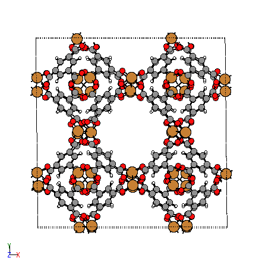
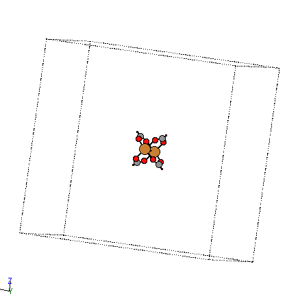
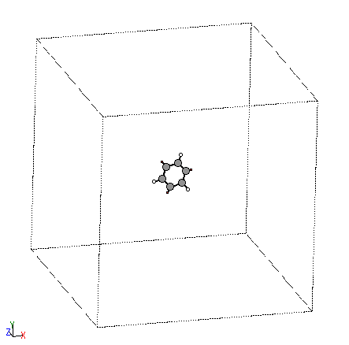

# MOF Destructor

A module for the extractions building blocks from MOFs. It's refactored from the
legacy code used in the PORMAKE paper. It is an experimental feature and may not
 be stable.

## Minimal usage
For the demonstration, make a MOF CIF file using PORMAKE. We use HKUST-1 here.

```python
import pormake as pm

database = pm.Database()
tbo = database.get_topo("tbo")

# Copper paddle-wheel.
N409 = database.get_bb("N409")

# BTC linker.
N10 = database.get_bb("N10")

# Make HKUST-1.
builder = pm.Builder()
HKUST1 = builder.build_by_type(topology=tbo, node_bbs={0: N10, 1: N409})
HKUST1.write_cif('HKUST1.cif')
```

In order to destruct the MOF into building blocks, import `MOFDestructor`.
```python
from pormake.experimental.destructor import MOFDestructor
```

Then load CIF of HKUST-1 using following code. Bond information in the CIF can't
be load in current version. Therefore all bond connectivities are computed by
distance based method.
```python
destructor = MOFDestructor(cif='HKUST-1.cif')
```

You can check the loaded MOF using `view()` method.
```python
destructor.view()
```



In addition, you can clean-up MOF structure by using `cleanup()` method. This
method removes interpenatration and isolated molecules in MOFs. **We highly
recommend to use `cleanup` method before the extractions of building blocks.**
```python
destructor.cleanup()
```

It's almost done. Now you can access to the building blocks via `building_blocks`
property. For first accessment, it can take few seconds.

Input:
```python
destructor.building_blocks
```

Output:
```python
[
    Atoms(symbols='C6H3X3', ...),
    Atoms(symbols='CCuO2CuCO2C2O4X4', ...),
    Atoms(symbols='CCuO2CuCO2C2O4X4', ...),
    ...
]
```

The output of building_blocks is an list of `ase.Atoms`. You can check the
extracted building blocks using `ase.visualize.view` method.

```python
from ase.visualize import view

view(destructor.building_blocks[0])
view(destructor.building_blocks[1])
```

 

Furthermore, you can group duplicated building blocks by using `hash_atoms`
function. `hash_atoms` is a simple hash function that converts atoms object into
an unique integer.

Input:
```python
from collections import defaultdict
from pormake.experimental.destructor import hash_atoms


bb_dict = defaultdict(list)
for atoms in destructor.building_blocks:
    hash_ = hash_atoms(atoms)
    bb_dict[hash_].append(atoms)

print(bb_dict.keys())
```

Output:
```
dict_keys([154263, 865992])
```

As expected, there are only two types of building blocks in HKUST-1
(Copper paddle-wheel and BTC-linker).

Finally, you can check the dimension of building block using
`estimate_atoms_dimension` function. For current version of PORMAKE, building
blocks with zero dimension are allowed only.

Input:
```python
from pormake.experimental.destructor import estimate_atoms_dimension

estimate_atoms_dimension(destructor.building_blocks[0])
```

Output:
```
0
```
